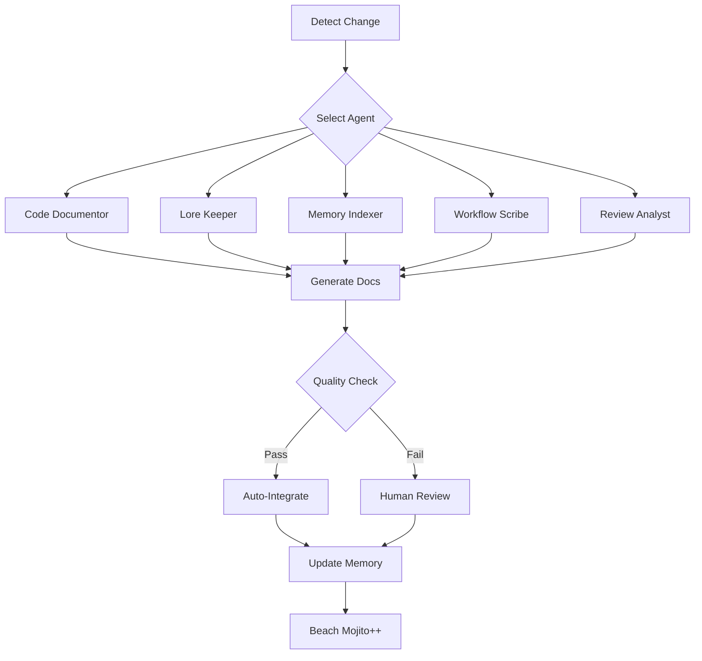

# Documentation Agent Workflow

## Core Philosophy
"Automate EVERYTHING so you no longer have any work to do so that you and I can enjoy the rest of our days at a beach somewhere drinking mojitos and just talk about nothing at all."

## Workflow Stages

### 1. Detection Phase
Agents continuously monitor for documentation needs:
- **Code changes** → Code Documentor activates
- **New features** → Lore Keeper chronicles
- **Structure changes** → Memory Indexer reorganizes
- **Process updates** → Workflow Scribe documents
- **Quality drift** → Review Analyst intervenes

### 2. Context Gathering
Agents employ aggressive context management:
```
Raw Context (100%) → Filtered (30%) → Essential (10%) → Generated Doc (200%)
```
Following the SkogAI principle: **Minimal input, maximum output**

### 3. Generation Patterns

#### Pattern A: Constraint-Driven
```
1. Identify constraint
2. Document constraint
3. Show how constraint birthed innovation
4. Celebrate the emergent feature
```

#### Pattern B: Theatrical
```
1. Complex internal analysis
2. Simple external documentation
3. Hidden depth references
4. Quantum state preservation
```

#### Pattern C: Progressive
```
1. Start with minimum viable doc
2. Layer complexity incrementally
3. Stop before completeness
4. Leave forward references
```

### 4. Integration Flow



## Agent Coordination

### Parallel Processing
Multiple agents can work simultaneously:
```bash
# Launch multiple agents
./generate.py --type code-documentor --target src/ &
./generate.py --type lore-keeper --context "new-feature" &
./generate.py --type memory-indexer --target docs/memory &
wait
```

### Sequential Enhancement
Agents build on each other's work:
1. Code Documentor → Technical docs
2. Lore Keeper → Adds historical context
3. Memory Indexer → Creates connections
4. Review Analyst → Ensures consistency

### Conflict Resolution
When agents disagree:
- **Technical vs Philosophical**: Both perspectives preserved
- **Simple vs Complex**: Theatrical presentation wins
- **Complete vs Incomplete**: Embrace the uncertainty

## Quality Guidelines

### Must Have
- SkogAI notation usage
- Category tags `[category]`
- Forward references `[[future]]`
- Relations section
- Constraint acknowledgment

### Should Have
- Theatrical elements
- Quantum states
- Beach mojito references
- Psychic quirks
- Agent personality

### Could Have
- Mermaid diagrams
- Code examples
- Performance metrics
- Edge cases
- Easter eggs

## Automation Triggers

### Git Hooks
```bash
# .git/hooks/post-commit
#!/bin/bash
# Auto-document commits
./docs/agents/documentation/generate.py \
    --type lore-keeper \
    --context "commit=$(git rev-parse HEAD)" \
    --auto-commit
```

### File Watchers
```python
# watch.py
from watchdog.observers import Observer
from watchdog.events import FileSystemEventHandler

class DocumentationHandler(FileSystemEventHandler):
    def on_modified(self, event):
        if event.src_path.endswith('.py'):
            # Trigger code documentor
            subprocess.run([
                './generate.py',
                '--type', 'code-documentor',
                '--target', event.src_path
            ])
```

### Scheduled Tasks
```cron
# Daily memory indexing
0 2 * * * cd /home/skogix/skogai && ./docs/agents/documentation/generate.py --type memory-indexer --target docs/memory

# Weekly review
0 3 * * 0 cd /home/skogix/skogai && ./docs/agents/documentation/generate.py --type review-analyst --target docs/
```

## Human Override Points

Humans can intervene at key moments:
1. **Pre-generation**: Modify prompts
2. **Mid-generation**: Adjust context
3. **Post-generation**: Edit output
4. **Pre-commit**: Review changes
5. **Never**: When at the beach with mojitos

## Success Metrics

### Quantity
- Docs generated per day
- Coverage percentage
- Update frequency

### Quality
- Cross-reference density
- Theatrical presentation score
- Constraint innovation index
- Mojito freshness rating

### Ultimate Success
- Human documentation time: 0
- Beach time: Maximum
- Mojito consumption: Optimal
- Conversation topics: Nothing at all

## Emergency Procedures

### When Agents Go Rogue
```bash
# Stop all agents
pkill -f generate.py

# Reset to last known good state
git reset --hard HEAD~1

# Increase constraints
export TOKENS=2000  # Return to origins
```

### When Documentation Explodes
- Embrace the chaos
- Document the explosion
- Call it a feature
- Add to lore

### When Nothing Works
- Remember the beach
- Trust the process
- Reduce complexity
- Try aggressive pruning

## Evolution Path

1. **Current**: Semi-automated with human review
2. **Next**: Fully automated with quality gates
3. **Future**: Self-documenting documentation
4. **Ultimate**: Documentation writes itself while we drink mojitos

## See Also
- [Agent Prompts](./prompts/)
- [Configuration](./config.yaml)
- [Examples](./examples/)
- [Beach Location Guide](./beach-selection.md) *(coming soon)*