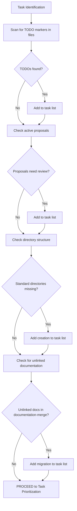

# Task Identification

This decision tree helps a local LLM identify tasks that need to be performed in the repository.



## Implementation Steps

1. **Scan for TODO Markers**
   ```bash
   TODO_FILES=$(grep -l "TODO" --include="*.md" --include="*.sh" -r .)
   if [[ -n "$TODO_FILES" ]]; then
     # Add to task list
     echo "TODO items found in: $TODO_FILES" >> tasks.txt
   fi
   ```

2. **Check Active Proposals**
   ```bash
   PROPOSAL_BRANCHES=$(git branch | grep "proposal/" | sed 's/^\*//g' | sed 's/^ *//')
   if [[ -n "$PROPOSAL_BRANCHES" ]]; then
     # Check if proposals need review
     for branch in $PROPOSAL_BRANCHES; do
       # Logic to determine if review is needed
       echo "Review needed for: $branch" >> tasks.txt
     done
   fi
   ```

3. **Check Directory Structure**
   ```bash
   REQUIRED_DIRS=("architecture" "standards" "workflows" "features" "agents" "proposals")
   for dir in "${REQUIRED_DIRS[@]}"; do
     if [[ ! -d "$dir" ]]; then
       echo "Create directory: $dir" >> tasks.txt
     fi
   done
   ```

4. **Check for Unlinked Documentation**
   ```bash
   # Logic to find documentation in documentation-merge that isn't in the current repository
   # This would require a more complex script to compare directories
   ```
